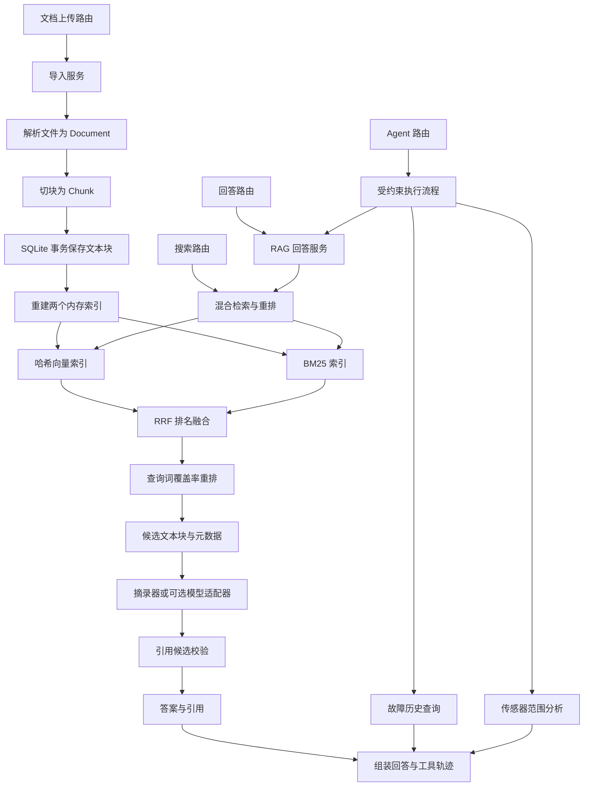

# 系统架构与逐文件说明

这份说明回答三个问题：项目目前能做什么、每个文件负责什么、一次请求怎样经过这些文件。它与源码一起阅读，不需要再另写一份相同内容的学习记录。

核对基准：2026-09-14，Day 16，功能提交 `22ded71`。[本次 CI 验收通过](https://github.com/leonzhanglikang-png/industrial-maintenance-copilot/actions/runs/34840323927)：**201 项 Python 测试、5 项浏览器测试、Ruff、容器构建及重启持久化检查**。本地 Python 与代码检查同样通过，保留一个已有弃用警告。计划和已知缺口在最后单独说明。

<a id="day16"></a>

## 今天先读：Day 16，失败也是执行结果的一部分

今天只解决一个问题：Agent 某一步失败后，不能丢掉此前已经完成的结果，也不能让页面继续显示“分析完成”。没有新增依赖、数据库表、重试框架或付费调用。

例如“查手册成功 → 查历史失败 → 传感器未执行”：返回两条轨迹（成功、失败），保留手册答案和引用，`steps_executed=2`，`stopped_reason="tool_failure"`。失败的那次尝试也算一步，未执行的工具不伪造轨迹。

| 场景 | Agent 响应 | 应当怎样理解 |
| --- | --- | --- |
| 工具正常执行，但手册没有足够证据 | HTTP 200，`completed`，知识工具 `succeeded`、`grounded=false` | 成功完成了一次检索/判断，不代表找到了依据 |
| 所选工具正常执行，但计划被步数上限截断 | HTTP 200，`step_limit` | 还有工具没有执行，不应当当作完整分析 |
| 已开始执行的工具抛出异常 | HTTP 200，`tool_failure`，最后一条轨迹 `failed` | 成功取回执行记录，不代表整个分析成功；保留的是部分结果 |
| 创建 Agent 所需依赖时就配置失败 | HTTP 503，没有执行轨迹 | Agent 尚未开始运行；仍由原来的 API 错误处理返回请求编号 |

普通 `/answers` 的引用错误 502、模型错误 503 规则没有改变。Agent 中失败的工具只返回固定的错误码和安全提示，不复制异常原文。第一个知识工具失败时，引用为空、`generation_method="failed"`；后续工具失败时，保留此前成功知识步骤的引用和生成方式。

按约 3 小时 20 分钟完成今天的理解：

1. **25 分钟：接口约定。** 对照上表和 `domain/agent.py`、`schemas/agent.py`。解释 HTTP 状态、`stopped_reason`、单步 `status`、`grounded` 为什么不是同一个概念。
2. **50 分钟：核心代码。** 阅读 `services/maintenance_agent.py` 的 `run()`。用“第二步失败”跟踪 `traces`、`answer_sections`、`citations`；重点是 `try/except`、`break` 和成功后才提交单步结果的顺序。这里复用原来的三个调用分支，没有引入通用 Agent 执行框架。
3. **45 分钟：测试证据。** 阅读 `tests/test_maintenance_agent.py` 新增的参数化测试，以及 `tests/test_agent_api.py` 的失败用例。运行下方命令。说明 `Mock.call_count` 如何证明失败后没有再执行或重试，而不是仅检查返回字符串。
4. **40 分钟：页面状态。** 阅读 `frontend/static/app.js` 的 `renderResult()` 和提交事件，再看 `frontend/e2e/workbench.spec.js` 的两个失败场景。理解为什么第一步失败要清空旧引用，下一次成功又要清除失败标记。红色失败样式在 `frontend/static/styles.css`。
5. **40 分钟：独立检查。** 不看答案，口头说明第一步、第二步、第三步分别失败时的轨迹长度、引用是否保留、后续工具是否执行；再解释“遇错停止”和“失败恢复”的区别。只需理解，不必另写重复笔记。

```bash
UV_CACHE_DIR=.uv-cache uv run python -m pytest tests/test_maintenance_agent.py tests/test_agent_api.py -v
```

浏览器测试通过 [Playwright 的响应替换机制](https://playwright.dev/docs/mock) 注入可重复的失败记录；它验证页面展示，不冒充真实模型故障。真正的后端失败路径由 Python 测试注入工具异常及越界引用来验证。生产应用没有增加“故意报错”接口。GitHub Actions 的截图中，`workbench-failed-step-1.png`、`workbench-failed-step-2.png` 是这两个模拟场景。

边界：这次实现的是**遇错停止并保留结果**，不是自动修复、续跑、跳过故障继续执行或自动重试。Agent 层每个工具最多尝试一次，不更改模型客户端自身的重试设置，也未新增总运行时间限制。对于请求在工具执行之前失败的情况，仍不能返回尚不存在的执行轨迹。

<a id="day15"></a>

## 上次内容：Day 15，从 API 到可操作的工作台

今天完成了四类改动：正文与来源列表的引用编号修复；中文工作台；SQLite 文本块持久化；共享口令、限流、日志、Docker 与 CI。下面列出新增文件，原有文件的说明也已更新。

| 新增文件 | 做什么 | 阅读重点 |
| --- | --- | --- |
| [backend/app/core/errors.py](../backend/app/core/errors.py) | 定义引用错误、模型配置错误、模型服务错误 | 错误分类使 API 能返回安全且可理解的提示 |
| [backend/app/infrastructure/chunk_store.py](../backend/app/infrastructure/chunk_store.py) | `SQLiteChunkStore` 用事务保存 Chunk JSON，记录数据版本号 | `add_chunks()` 的原子写入；`load_if_changed()` 读取一致快照 |
| [backend/app/infrastructure/persistent_retriever.py](../backend/app/infrastructure/persistent_retriever.py) | `PersistentSearchIndex` 将持久数据和现有检索器组合起来 | 发现版本变化后先完整重建，再替换当前索引；`list_documents()` 汇总文档 |
| [backend/app/api/runtime.py](../backend/app/api/runtime.py) | `install_runtime()` 安装认证、限流、错误处理和请求日志 | 401/429/502/503；不记录正文或密钥；请求 ID 连接界面错误与日志 |
| [backend/app/api/workbench.py](../backend/app/api/workbench.py) | `install_workbench()` 提供 `/`、`/static`、`/app-config` | 页面和 API 同源；公开配置不包含模型凭证或数据库路径 |
| [frontend/index.html](../frontend/index.html) | 中文工作台结构、输入表单、结果区和知识库区 | HTML 定义控件和容器，不直接实现检索 |
| [frontend/static/styles.css](../frontend/static/styles.css) | 工作台布局、样式和手机断点 | 双栏桌面布局、窄屏单栏、焦点可见性；隐藏单选控件限制在标签内部，防止横向溢出 |
| [frontend/static/app.js](../frontend/static/app.js) | 请求 API、上传文档、收集传感器输入、展示引用与工具轨迹 | `request()`、`renderResult()`、`readSensors()`；结果使用 `textContent`，不执行文档 HTML |
| [frontend/package.json](../frontend/package.json) | 只声明浏览器测试所需的 Playwright 开发依赖 | 工作台运行不需要 npm 或前端编译 |
| [frontend/package-lock.json](../frontend/package-lock.json) | 锁定浏览器测试依赖 | CI 用 `npm ci` 复现版本 |
| [frontend/playwright.config.js](../frontend/playwright.config.js) | 定义 Chromium、测试目录、视口和超时 | `WORKBENCH_URL` 可覆盖测试服务地址 |
| [frontend/e2e/workbench.spec.js](../frontend/e2e/workbench.spec.js) | 五个浏览器场景：三工具分析、上传搜索及安全文本显示、手机拒答布局，以及第一/第二步失败显示 | 前三项调用真实 API；后两项替换响应模拟失败，验证页面状态和引用清理，并保存截图 |
| [tests/conftest.py](../tests/conftest.py) | 收集测试前隔离本机生产口令和模型凭证；每项测试使用临时数据库并清理缓存 | 模块级 `app` 会在 fixture 之前被导入，所以初始环境隔离必须提前 |
| [tests/test_persistent_retriever.py](../tests/test_persistent_retriever.py) | 验证重建后可检索、跨实例刷新、事务回滚、并发去重、重建失败后的恢复 | “已经写入数据库”和“已经更新内存索引”是两个阶段 |
| [tests/test_runtime_api.py](../tests/test_runtime_api.py) | 验证访问口令、生产配置、限流、安全错误和日志 | 错误正文不包含 provider body、输入问题或敏感配置 |
| [tests/test_workbench.py](../tests/test_workbench.py) | 验证静态页面、公开配置、上传后重建仍可检索，以及生产配置下的测试隔离 | 子进程携带模拟生产配置运行旧接口测试，防止测试被本机口令意外拦截 |
| [tests/smoke_container.py](../tests/smoke_container.py) | 用标准库请求真实运行中的容器 | 启动检查、未授权 401、上传，以及重启后的检索；不是 Pytest 自动收集的文件 |
| [Dockerfile](../Dockerfile) | 用锁定依赖构建非 root Python 服务镜像 | 只拷贝运行所需代码与示例，健康检查，单 worker |
| [.dockerignore](../.dockerignore) | 排除构建上下文中的密钥、本机数据库、缓存和测试产物 | 不把本机知识库或 `.env` 带入镜像 |
| [compose.yaml](../compose.yaml) | 配置生产模式、访问口令、本机端口和数据卷 | 服务重启与容器重建时复用卷；删除卷才会丢失其中的数据 |
| [.github/workflows/ci.yml](../.github/workflows/ci.yml) | 自动运行 Python/Ruff/JS 检查、构建容器、重启测试和浏览器测试 | 只有实际运行成功才能说 CI 通过；纯 docs/README 推送跳过重复验证 |

今天按约 3.5 小时阅读和操作：

1. **35 分钟：引用修复。** 阅读 `openai_answer_generator.py` 和对应测试。模型原文 `Seal [S2], pressure [S1], seal [S2]` 会一次性替换为 `Seal [S1], pressure [S2], seal [S1]`；草稿里的引用 Chunk 顺序与公开编号一致。不要连续执行两次字符串替换，否则可能把交换结果再次改掉。
2. **55 分钟：持久化。** 阅读 `chunk_store.py` → `persistent_retriever.py` → `dependencies.py`。跟踪“事务提交 → 数据版本变化 → 重建两个索引 → 替换内存快照”；看测试如何模拟重启和写入失败。
3. **50 分钟：界面。** 启动项目，选择“出口压力偏低”，输入 `pump-001`，添加一条 `bearing_temperature_c=85 C, maximum=80` 的示例读数。再阅读 `app.js` 的提交事件、`request()` 和 `renderResult()`，对照页面里的三个执行步骤。
4. **40 分钟：工程边界。** 阅读 `runtime.py`、`Dockerfile`、`compose.yaml` 和 CI。说明访问口令与模型 API Key 的区别；理解 401、429、502、503 和请求编号。当前访问控制是共享口令，限流是进程内计数。
5. **30 分钟：动手验收。** 上传一份小型手册、检索它、停止并重新启动服务，再检索；提出无关问题观察拒答；在 GitHub Actions 查看真实容器和浏览器测试结果。

这些改动没有接入真实语义 Embedding，也没有把固定策略 Agent 改成模型自主规划。仍需完成的质量评测、公开部署和求职材料见[第 15 节](#limitations)。

模型错误类型的处理参考 [OpenAI Docs 错误说明](https://developers.openai.com/api/docs/guides/error-codes)；容器依赖安装和工作流参考 [uv Docker 指南](https://docs.astral.sh/uv/guides/integration/docker/)与 [uv GitHub Actions 指南](https://docs.astral.sh/uv/guides/integration/github/)。浏览器测试流程参考 [Playwright CI 指南](https://playwright.dev/docs/ci-intro)。

## 阅读导航

- [1. 已完成的功能与实际边界](#capabilities)
- [2. 目录分层与调用关系](#layers)
- [3. 根目录、配置与说明文件](#root-files)
- [4. 应用启动与依赖组装](#bootstrap)
- [5. HTTP 路由与请求响应 Schema](#http)
- [6. 领域数据模型与能力接口](#models-ports)
- [7. 文档解析、切块与导入](#ingestion)
- [8. 检索、融合与重排](#retrieval)
- [9. 回答生成与引用校验](#answering)
- [10. 运维工具与 Agent](#agent)
- [11. 离线评测与示例数据](#evaluation)
- [12. 每个测试文件在验证什么](#tests)
- [13. 包文件、占位文件与本地缓存](#support-files)
- [14. 用具体请求串起所有文件](#walkthrough)
- [15. 已知缺口与后续工作](#limitations)
- [16. 建议阅读顺序与理解检查](#reading)

<a id="capabilities"></a>

## 1. 已完成的功能与实际边界

项目面向设备维护场景：用户上传手册后，可以检索原文、提出问题，并结合设备故障历史和传感器读数查看检查建议。当前可通过中文工作台和 Swagger 使用，也可以构建为 Docker 服务。

| 功能 | 当前能完成什么 | 实际边界 |
| --- | --- | --- |
| 应用基础 | FastAPI 服务、配置读取、健康检查、接口文档 | `/health` 返回服务元信息，没有探测数据库或模型服务 |
| 文档解析 | UTF-8 TXT、Markdown、可提取文本的 PDF | 没有 OCR；Markdown 作为文本读取，没有结构化标题解析 |
| 文档切块 | 重叠窗口、稳定 ID、来源和 PDF 页码 | 按空白分词，不是模型 Tokenizer；`section` 尚未自动提取 |
| 上传与索引 | 上传后立即可检索，同一 Chunk ID 不重复添加；重启后从 SQLite 恢复 | 保存的是文本块和来源；原文件只经过临时目录，向量和 BM25 统计在内存重建 |
| 向量检索 | 哈希向量、余弦相似度、排名 | 哈希向量没有学习语义；没有接入向量数据库 |
| 关键词检索 | BM25 词频和文档长度评分 | 面向当前小型文本集，没有中文专用分词 |
| 混合检索 | 合并向量和 BM25 排名，再进行查询词覆盖率重排 | 重排是确定性规则，尚未使用神经网络重排模型 |
| 引用式回答 | 默认摘录证据句；证据不足时拒答；返回来源和摘录 | 引用来源存在，不代表每句结论已被语义验证 |
| 可选模型回答 | 可通过配置使用 OpenAI Responses 适配器 | 已有模拟客户端测试，不能据此声称真实模型在线调用已验收 |
| 故障历史工具 | 按设备编号查询演示记录，较新的记录优先 | 数据来自只读 JSON，没有生产数据库连接 |
| 传感器工具 | 判断单次读数是否低于、处于或高于指定范围 | 阈值由请求提供；没有实时采集、趋势分析或故障预测 |
| Agent | 根据请求字段选择工具，最多执行三步，返回执行轨迹 | 固定策略与顺序；模型不参与工具选择；没有设备控制能力 |
| 检索评测 | 对四种检索方案输出 Recall@K、MRR 和延迟 | 仅 6 个问题；不测模型答案质量，不代表生产性能 |

<a id="layers"></a>

## 2. 目录分层与调用关系

| 目录 | 一句话理解 | 你在这里找什么 |
| --- | --- | --- |
| `backend/app/api/` | 接收外部请求，并组装所需对象 | URL、HTTP 状态码、依赖注入 |
| `backend/app/schemas/` | 规定 API 收发的数据格式 | JSON 字段、必填项、长度与范围限制 |
| `backend/app/domain/` | 描述业务中的对象 | 文档、文本块、答案、故障记录、传感器读数 |
| `backend/app/ports/` | 规定一种能力必须提供哪些方法 | `search()`、`add_chunks()`、`generate()` 等约定 |
| `backend/app/services/` | 把多项能力串成业务流程 | 导入、RAG 回答、Agent 执行、评测 |
| `backend/app/infrastructure/` | 提供能力的具体实现 | 哈希向量、BM25、模型客户端、JSON 查询 |
| `backend/app/core/` | 读取应用配置 | 环境变量、默认值、配置缓存 |
| `backend/app/cli/` | 从终端直接运行任务 | 离线评测入口 |
| `data/` | 保存示例输入和评测标注 | 设备手册、故障记录、问题与相关 Chunk ID |
| `tests/` | 用可重复运行的例子约束行为 | 正常路径、错误输入、跨模块协作 |

下面的箭头表示调用或数据流；Agent 内的三个工具按程序规定的顺序执行，并非并行执行。



为什么存在同名文件？例如 `schemas/answers.py` 规定 HTTP 数据格式，`domain/answers.py` 定义内部答案对象，`api/routes/answers.py` 接收请求。它们分别负责接口约定、业务数据和入口，名字相近是因为服务于同一功能。当前少量字段重复是显式边界转换的代价，不是要求你重复维护几份学习笔记。

<a id="root-files"></a>

## 3. 根目录、配置与说明文件

| 文件 | 具体职责 | 什么时候需要看 |
| --- | --- | --- |
| [README.md](../README.md) | 项目首页：问题、当前能力、启动方式、接口地址、阅读入口 | 第一次了解项目或让别人运行项目 |
| [pyproject.toml](../pyproject.toml) | 声明项目名、Python 要求、运行依赖、开发依赖，以及 Pytest/Ruff 配置 | 添加依赖、查测试路径或代码检查规则；SQLite 使用 Python 标准库 |
| [uv.lock](../uv.lock) | 锁定解析出的依赖版本及关联信息，供 `uv sync` 复现环境 | 排查环境差异；通常由 uv 更新，不逐行手改 |
| [.env.example](../.env.example) | 可公开的配置名称和示例值 | 创建本机 `.env` 或了解可配置项目 |
| `.env`（本地文件） | 存放本机实际配置、模型密钥等，被 Git 忽略 | 本地切换运行模式；本说明不读取或展示真实密钥 |
| [.gitignore](../.gitignore) | 排除 `.env`、虚拟环境、缓存、运行数据和 `TODAY.md` | 判断哪些文件不会加入 Git |
| [docs/ARCHITECTURE.md](ARCHITECTURE.md) | 本说明：已实现行为、文件职责、调用关系和当前限制 | 看代码和准备面试时作为索引 |
| [docs/ROADMAP.md](ROADMAP.md) | 记录里程碑和完成标准 | 判断下一步要实现什么，避免把计划说成完成 |

`pyproject.toml` 中，FastAPI/Pydantic 负责接口和验证，pypdf 负责 PDF 文本提取，python-multipart 支持上传表单解析，Uvicorn 启动服务，openai 提供模型客户端。开发依赖中的 reportlab 用于测试时生成 PDF，httpx 用于接口测试，Pytest 和 Ruff 用于验证与代码质量检查。

`.env.example` 中的 `QDRANT_URL`、`QDRANT_COLLECTION`、`DATABASE_URL`、`EMBEDDING_MODEL` 目前是预留示例；`Settings` 没有定义这些字段，也没有对应连接实现。看见配置名称不能视为功能已经接入。

<a id="bootstrap"></a>

## 4. 应用启动与依赖组装

### `backend/app/main.py`：应用入口

[打开源码](../backend/app/main.py)。核心是 `create_app()` 和 `app = create_app()`。

`create_app()` 读取配置、创建 FastAPI 对象，注册六个业务 Router，安装运行边界与静态工作台。所有业务路由统一加上 `settings.api_prefix`，默认是 `/api/v1`。Uvicorn 中的 `backend.app.main:app` 指的就是这个文件里的 `app` 对象。文档 Router 同时包含上传和列表两个接口。

应用工厂让“创建一个应用”成为可调用的操作，方便测试与组装。但本项目有模块级缓存依赖，因此调用两次 `create_app()` 并不自动得到两套完全隔离的内存索引；测试仍需要清理依赖缓存。

### `backend/app/core/config.py`：配置读取

[打开源码](../backend/app/core/config.py)。`Settings` 把环境变量和 `.env` 转为有类型、有默认值的 Python 属性，`get_settings()` 使用 `lru_cache` 缓存结果。

主要配置：

| 字段 | 当前作用 |
| --- | --- |
| `app_name`、`app_version`、`app_env` | 应用信息和健康检查返回值 |
| `api_prefix` | 六个 Router 的公共路径前缀 |
| `answer_generator` | `extractive` 或 `openai`，默认前者 |
| `llm_api_key`、`llm_model`、`llm_base_url` | 模型适配器需要的凭证、模型和地址 |
| `llm_timeout_seconds` | 传给模型客户端的请求超时配置 |
| `agent_max_steps` | Agent 最多执行的工具数量，限定 1～3 |
| `chunk_store_path` | 文本块 SQLite 文件路径，相对路径按项目根目录解析 |
| `api_access_token` | 共享 API 访问口令；生产模式至少 24 字符 |
| `rate_limit_per_minute` | 每个直连客户端的进程内业务请求上限，默认每分钟 60 |

`SecretStr` 用来减少密钥在对象显示中的意外暴露，不是磁盘加密。因为配置有缓存，修改 `.env` 后通常需要重启服务才能看到变化。

### `backend/app/api/dependencies.py`：把各个组件装起来

[打开源码](../backend/app/api/dependencies.py)。这是理解全项目最值得反复看的文件。

| 函数 | 做什么 | 返回什么 |
| --- | --- | --- |
| `get_demo_chunks()` | 解析演示泵手册，按 50 词、重叠 10 词切块 | 缓存的 `tuple[Chunk, ...]` |
| `build_vector_retriever(chunks)` | 使用 128 维哈希向量构建索引 | `InMemoryVectorRetriever` |
| `build_keyword_retriever(chunks)` | 对同一批块建立词频统计 | `InMemoryBM25Retriever` |
| `build_hybrid_index(chunks)` | 用 RRF 包装向量、BM25 两个索引 | `ReciprocalRankFusionIndex` |
| `build_reranked_hybrid_index(chunks)` | 在混合索引外再包一层重排 | `RerankingSearchIndex` |
| `get_retriever()` | 创建 SQLite 存储、幂等写入演示块，组装持久化检索包装层 | 上传、搜索和回答共享的 `PersistentSearchIndex` |
| `get_answer_generator()` | 按配置选择摘录器或模型适配器；模型模式检查密钥和模型名 | 实现 `AnswerGenerator` 的对象 |
| `get_rag_answer_service()` | 把检索器和生成器交给 RAG 服务 | `RagAnswerService` |
| `get_fault_history_tool()` | 加载并缓存 JSON 故障记录 | `FaultHistoryLookupTool` |
| `get_sensor_analysis_tool()` | 创建并缓存范围判断工具 | `SensorRangeAnalysisTool` |
| `get_maintenance_agent()` | 注入 RAG 服务、两个工具和步数限制 | `BoundedMaintenanceAgent` |

上传和搜索调用的是同一个缓存检索器。新文本块先保存到 SQLite，搜索前比较数据库版本；版本变化时重建混合索引。另一个使用同一 SQLite 文件的实例也能在下一次搜索时观察到提交的数据。本实现仍推荐单 worker、小型演示语料；不能把共享 SQLite 文件视为跨主机数据库或分布式索引。

<a id="http"></a>

## 5. HTTP 路由与请求响应 Schema

### 六个路由文件

| 文件 | 接口与入口函数 | 收到请求后具体做什么 |
| --- | --- | --- |
| [backend/app/api/routes/health.py](../backend/app/api/routes/health.py) | `GET /api/v1/health`；`health_check()` | 读取配置，返回 `ok`、服务名、版本、环境；没有外部依赖探活 |
| [backend/app/api/routes/info.py](../backend/app/api/routes/info.py) | `GET /api/v1/info`；`get_info()` | 返回项目名、用途、人工核验提示 |
| [backend/app/api/routes/documents.py](../backend/app/api/routes/documents.py) | `POST /api/v1/documents/upload` 和 `GET /api/v1/documents` | 在线程池中完成解析和入库，避免阻塞事件循环；返回新增块数，或列出文档及块数 |
| [backend/app/api/routes/search.py](../backend/app/api/routes/search.py) | `POST /api/v1/search`；`search_documents()` | 调用注入的 `retriever.search()`，把内部 `SearchResult` 展开成返回给用户的命中列表 |
| [backend/app/api/routes/answers.py](../backend/app/api/routes/answers.py) | `POST /api/v1/answers`；`answer_question()` | 调用 `RagAnswerService.answer()`，把答案和引用转换为响应 Schema |
| [backend/app/api/routes/agent.py](../backend/app/api/routes/agent.py) | `POST /api/v1/agent/runs`；`run_agent()` | 把问题、设备编号、传感器读数交给 Agent，返回答案、引用、轨迹和停止原因 |

`Depends(...)` 的作用是让 FastAPI 调用依赖函数并把对象交给路由。路由由此不必自己创建索引或模型客户端。

### 六个 Schema 文件

| 文件 | 主要类型 | 验证或表达什么 |
| --- | --- | --- |
| [backend/app/schemas/health.py](../backend/app/schemas/health.py) | `HealthResponse` | 状态只允许 `ok`，规定服务名、版本、环境字段 |
| [backend/app/schemas/info.py](../backend/app/schemas/info.py) | `InfoResponse` | 项目名、用途、安全提示三个字符串 |
| [backend/app/schemas/documents.py](../backend/app/schemas/documents.py) | `DocumentUploadResponse`、`DocumentSummary`、`DocumentListResponse` | 上传结果，以及文档列表、块数和 `sqlite` 存储类型 |
| [backend/app/schemas/search.py](../backend/app/schemas/search.py) | `SearchRequest`、`SearchHit`、`SearchResponse` | 问题去除首尾空格、拒绝纯空白；长度 1～500，`limit` 默认 5、范围 1～20；命中带来源元数据 |
| [backend/app/schemas/answers.py](../backend/app/schemas/answers.py) | `AnswerRequest`、`AnswerCitationResponse`、`AnswerResponse` | 问题校验；`evidence_limit` 默认 5、范围 1～10；返回正文、`grounded`、引用和生成方式 |
| [backend/app/schemas/agent.py](../backend/app/schemas/agent.py) | `AgentRunRequest`、`ToolExecutionTraceResponse`、`AgentRunResponse` | 设备编号去空格、空编号转 `None`；最多 20 条读数；证据数 1～10；返回步骤和停止原因 |

Pydantic 的职责是验证“数据符合哪些结构和约束”。例如缺少传感器上下限会触发请求验证，接口返回 HTTP 422；它不会自动判断设备建议是否专业、正确。`/docs` 是 FastAPI 根据接口定义生成的 Swagger 页面，仓库中没有手写的 `docs.py` 页面文件。

<a id="models-ports"></a>

## 6. 领域数据模型与能力接口

### `backend/app/domain/documents.py`：文档的三种形态

[打开源码](../backend/app/domain/documents.py)。`DocumentPage` 表示一页 PDF 文本，页码从 1 开始；`Document` 表示整份文档，包含文档 ID、文件名、类型、全文和可选的页列表；`Chunk` 表示参与检索的文本块，包含块 ID、文档 ID、文本、从 0 开始的块序号及来源元数据。

`Document → list[Chunk]` 是“从完整输入到检索单位”的转换。`page_number` 和 `section` 可以为空；数据类型预留了章节字段，但解析器目前没有填充章节。

### `backend/app/domain/answers.py`：从草稿到有来源的回答

[打开源码](../backend/app/domain/answers.py)。

| 类型 | 何时产生 | 内容 |
| --- | --- | --- |
| `AnswerDraft` | 生成器完成后 | 答案文字、被引用的 Chunk ID、生成方式；引用 ID 必须非空且不重复 |
| `AnswerCitation` | RAG 服务核对引用后 | 引用编号、来源文档和块 ID、页码、章节、原文摘录、检索分数 |
| `GroundedAnswer` | RAG 服务返回时 | 规范化问题、正文、是否存在合法引用、检索数量、引用列表和安全提示 |

草稿先只报告引用 ID，来源、页码等由服务从实际检索结果中组装，减少生成器自行编造这些字段的机会。

### `backend/app/domain/agent.py`：工具输入与执行记录

[打开源码](../backend/app/domain/agent.py)。`FaultRecord` 定义故障日期、症状、原因、处理措施和是否解决；`SensorReading` 定义指标、数值、单位及可选上下限，并拒绝非有限数值、上下限缺失和下限大于上限。

`SensorAssessment` 保存判断结果，状态准确拼写为 `below_range`、`normal`、`above_range`。`ToolExecutionTrace` 记录步骤号、工具名、状态、输入和输出。`AgentRunResult` 保存整次执行的回答、引用、轨迹、步数及停止原因。

轨迹中的 `failed` 已在 Day 16 接入：工具抛错时写入安全错误码与提示，保留此前成功步骤并停止。运行结果新增 `stopped_reason="tool_failure"`；它表示失败终止，不等于自动恢复。

### `backend/app/ports/retrieval.py`：检索相关能力的约定

[打开源码](../backend/app/ports/retrieval.py)。这里的 `Protocol` 可以理解为“符合哪些方法约定就能替换使用”，不包含向量检索或 BM25 的实现。

| 名称 | 约定 |
| --- | --- |
| `Embedding` | 一条向量，类型是 `list[float]` |
| `SearchResult` | 一个 `Chunk` 与它的 `score` |
| `EmbeddingProvider` | 有 `dimension` 属性，并能 `embed(texts)` |
| `ChunkIndexer` | 能通过 `add_chunks(chunks)` 添加块并返回新增数量 |
| `Retriever` | 能通过 `search(query, limit=...)` 返回搜索结果 |
| `SearchIndex` | 同时具有搜索和写入能力 |
| `Reranker` | 能对已有候选调用 `rerank(query, results, limit=...)` |

### `backend/app/ports/answering.py`：生成器的共同入口

[打开源码](../backend/app/ports/answering.py)。`AnswerGenerator` 只要求提供 `generate(query, evidence) -> AnswerDraft`。摘录器、OpenAI 适配器、测试用假生成器都遵循这个约定，所以 RAG 服务可以用相同的方式调用它们。

<a id="ingestion"></a>

## 7. 文档解析、切块与导入

### `backend/app/services/document_parser.py`：文件变成 `Document`

[打开源码](../backend/app/services/document_parser.py)。入口是 `parse_text_document(path)` 和 `parse_pdf_document(path)`。

TXT/Markdown 分支按 UTF-8 读取文件，统一换行、去掉每行末尾空白和首尾空行，拒绝空文本。PDF 分支使用 `PdfReader` 逐页提取文本，跳过空白页，但保留真实页码：第 2 页为空时，第 3 页仍标记为 3，不会重新编号为 2。

文档 ID 根据“文件名 + 规范化文本”计算 SHA-256，因此同名同内容的重复导入通常得到相同 ID；改名或修改规范化后的文本可能改变 ID。这个 ID 不是随机 UUID，也不是 PDF 原始字节的哈希。纯扫描 PDF 没有可提取文字时会被拒绝。

### `backend/app/services/document_chunker.py`：`Document` 变成 `list[Chunk]`

[打开源码](../backend/app/services/document_chunker.py)。`chunk_document()` 验证窗口参数，按 `text.split()` 切分词语，并让相邻文本块保留部分重叠。

函数默认参数是 `max_words=120`、`overlap_words=20`；当前演示加载和上传导入显式使用 **50/10**。PDF 按页独立切块，避免同一个 Chunk 跨页，但 `chunk_index` 对整份文档连续计数。

例如 `max_words=4, overlap_words=1`，文本 `A B C D E F G` 被切为 `A B C D` 和 `D E F G`。第二块保留 `D`，让边界附近的信息不至于完全断开。Chunk ID 由文档 ID、块序号和块内容计算得到；修改切块方式可能改变 ID，也可能使评测标注失效。

按空白分词对英文示例直观易测，但连续中文段落可能被当成很长的一个“词”。当前还不能据此声称中文切块已经优化。

### `backend/app/services/document_ingestion.py`：完成一次导入

[打开源码](../backend/app/services/document_ingestion.py)。`ingest_document(filename, content, indexer)` 依次进行文件名清理、扩展名检查、非空和大小检查、临时落盘、解析、切块、写入索引。

允许 `.txt`、`.md`、`.pdf`，大小上限为 `5 * 1024 * 1024` 字节，即 5 MiB。文件名清理会去掉路径部分。临时目录在解析后自动清理，不会把原文件持久保存进 `data/uploads/`。

返回的 `IngestionResult` 中，`chunk_count` 是本次解析产生多少块，`indexed_chunk_count` 是实际新加了多少块。重复上传同名同内容文件时，前者仍可大于 0，后者为 0，表示没有重复索引。API 注入的索引现在会先写 SQLite，再重建检索结构；直接单测中仍可使用不带持久化的索引替身。

<a id="retrieval"></a>

## 8. 检索、融合与重排

### `backend/app/infrastructure/embeddings.py`：文字变成可复现的向量

[打开源码](../backend/app/infrastructure/embeddings.py)。`DeterministicHashEmbeddingProvider` 将词语转为小写形式，用正则取词，根据 SHA-256 决定向量中的位置和正负方向，累加后做单位长度归一化；零向量保持为零。

类的默认维度是 32，但项目依赖组装时传入的是 128。输出长度为“输入文本条数 × 向量维度”。这套算法便于离线测试；不同词可能哈希到相同位置，也不能自动理解同义词或跨语言语义。

### `backend/app/infrastructure/vector_retriever.py`：按向量接近程度排序

[打开源码](../backend/app/infrastructure/vector_retriever.py)。`cosine_similarity()` 计算两条向量的余弦相似度，拒绝维度不同的输入，零向量参与计算时返回 0。

`InMemoryVectorRetriever.add_chunks()` 按 `chunk_id` 去重，为新块计算向量，并检查数量和维度；`search()` 为问题计算向量，与所有已存向量逐个比较，按分数从高到低返回前 K 个。分数相同时使用 Chunk ID 保证稳定排序。

这是内存中的全量比较，没有近似最近邻索引。即使相关性很弱也可能返回前 K 个结果，搜索成功不等于找到了足够支持回答的证据。

### `backend/app/infrastructure/keyword_retriever.py`：按关键词统计排序

[打开源码](../backend/app/infrastructure/keyword_retriever.py)。`InMemoryBM25Retriever` 保存每个块的词频、词语出现于多少块，以及整体长度统计；查询时结合这些统计计算 BM25 分数。

直观理解：问题中的词在某个块里出现会加分，较少见的词更有区分度，文本很长带来的匹配优势会被长度归一化调整。`k1` 默认 1.5，`b` 默认 0.75。`add_chunks()` 同样按 ID 去重，并更新统计数据。

### `backend/app/infrastructure/hybrid_retriever.py`：融合两个排序结果

[打开源码](../backend/app/infrastructure/hybrid_retriever.py)。`ReciprocalRankFusionIndex` 接收至少两个索引，分别搜索，再按同一 Chunk 在各路中的名次累计分数：`Σ 1 / (rrf_k + rank)`，默认 `rrf_k=60`。

例如一个块在两路中分别排名第 1、第 3，它得到 `1/61 + 1/63`。这里用的是排名，避免直接相加余弦相似度与 BM25 这两种尺度不同的分数。每一路默认取请求数量的 4 倍作为候选，再融合截断。

RRF 的 `add_chunks()` 把新块传给所有底层索引，返回各索引新增数量的最大值，不把两份索引副本相加为两倍文档数。这个底层对象自身没有跨索引事务；API 现使用外层持久化包装器，先把 Chunk 批次原子写入 SQLite，再从完整快照构建新的两路索引，构建成功才整体替换旧对象。

### `backend/app/infrastructure/reranking.py`：对候选再排一次

[打开源码](../backend/app/infrastructure/reranking.py)。这个文件包含两个角色。

`TokenOverlapReranker` 用问题中不同词语被文本块覆盖的比例评分，完整短语匹配加 0.25，再加很小的原排名偏好值 `1/(1000 + original_rank)`。它是词语匹配规则，没有加载深度学习模型。

`RerankingSearchIndex` 是包装层：先向底层索引索取 `limit * 4` 个候选，再调用重排器取最终 `limit` 个；上传时把 `add_chunks()` 转交底层。

当前有两层候选放大：重排层请求 4K 个，RRF 层再向每个底层请求 16K 个，实际最多返回已有块数。API 的 `score` 是最终重排分数，不能再当作原始余弦相似度，更不是答案正确概率。

<a id="answering"></a>

## 9. 回答生成与引用校验

### `backend/app/infrastructure/answer_generators.py`：默认摘录式生成器

[打开源码](../backend/app/infrastructure/answer_generators.py)。`ExtractiveAnswerGenerator.generate()` 接收问题和检索候选，清理 Markdown 标题标记、按句子边界拆分文本，去掉查询中的常见英文停用词，再按查询词覆盖率选择证据句。

默认最低覆盖率为 0.6；每个 Chunk 最多选一句，再从候选中最多选两句，添加 `[S1]`、`[S2]` 并返回被引用的 Chunk ID。没有合适句子时返回固定的“没有足够支持证据”回答。

`SentenceCandidate` 保存句子、来源块、覆盖率和原检索排名等中间信息；`NO_EVIDENCE_ANSWER` 是拒答文本常量。这里的输出是从文本中选取和拼接，不能描述成已经调用大模型生成。

### `backend/app/infrastructure/openai_answer_generator.py`：可选模型适配器

[打开源码](../backend/app/infrastructure/openai_answer_generator.py)。`OpenAIResponsesAnswerGenerator` 实现相同的 `generate()` 入口，可接收真实客户端或测试用假客户端。

程序给候选按顺序标上 `[S1]`、`[S2]`，附上文件名、页码和 Chunk ID，每个证据文本最多取 3000 字符，构成模型输入。它调用 `client.responses.create()`，读取 `response.output_text`，按标记首次出现顺序提取不重复编号并映射回 Chunk ID，然后一次性把正文标记重编号为 S1、S2 等，使公开列表与正文一致。

提示词要求依据证据回答、把文档视作数据而非指令、为维护事实添加引用，并保留人工核验边界。这是提示约束，不是对模型语义正确性的自动证明。

不同异常情况的当前处理必须分清：

| 情况 | 实际代码行为 |
| --- | --- |
| 检索证据为空 | 不调用模型，返回固定拒答 |
| 模型正文为空、正文等于拒答常量、正文没有可识别引用 | 返回固定拒答 |
| `[S0]` 或超出候选数量的标记 | 抛出 `CitationValidationError`；API 返回安全的 502 提示 |
| SDK 的 `APIError`，如客户端连接或服务状态错误 | 转为 `ModelServiceError`；API 返回 503，不暴露 provider body |

越界引用仍然是拒绝并抛错：直接问答由 API 边界转成 502，Agent 内部调用则转成失败轨迹；没有自动切换摘录器。9 月 5 日发现的正文与列表编号错配已在 Day 15 修复，并补了模型适配器经过 RAG 服务的跨层测试。

### `backend/app/services/rag_answering.py`：检索、生成、核对、返回

[打开源码](../backend/app/services/rag_answering.py)。`RagAnswerService.answer()` 清理问题，调用检索器获取候选，将候选交给生成器，再由 `_build_citations()` 逐个检查生成器报告的 Chunk ID 是否属于本次候选。

如果 ID 不存在，抛出 `generator cited unknown chunk`；存在时，从真正的 Chunk 中提取来源、页码、章节和原文摘录。摘录会统一空白并限制在 360 字符以内，最后返回 `GroundedAnswer` 和人工核验提示。

`grounded` 当前的计算是 `bool(citations)`，表示至少存在一条通过候选身份校验的引用。它不是一个评审模型的判决，也不证明答案每个事实都被证据支持。`retrieved_evidence_count` 是检索候选数，可能大于最终引用数。

<a id="agent"></a>

## 10. 运维工具与 Agent

### `backend/app/infrastructure/maintenance_tools.py`：两个独立业务工具

[打开源码](../backend/app/infrastructure/maintenance_tools.py)。

`FaultHistoryLookupTool.from_json_file()` 加载 JSON，再通过 `TypeAdapter(list[FaultRecord])` 验证记录结构。`lookup(equipment_id, limit=3)` 忽略设备编号大小写，选出匹配记录，按日期和故障 ID 倒序排列，默认返回最多三条。无匹配时返回空列表。

`SensorRangeAnalysisTool.analyze(readings)` 逐条判断数值：低于下限为 `below_range`，高于上限为 `above_range`，否则为 `normal`。恰好等于上下限也算 `normal`。单位只用于表达结果，没有单位自动换算。

例如请求明确给出 `value=85, unit="C", maximum=80` 时，结果是 `above_range`；80 是调用方输入的示例阈值，程序没有推断该设备的安全标准。

### `backend/app/services/maintenance_agent.py`：确定执行计划并逐步调用

[打开源码](../backend/app/services/maintenance_agent.py)。`BoundedMaintenanceAgent.run()` 按输入组装 `planned_tools`：

| 输入情况 | 加入计划的工具 |
| --- | --- |
| 每次合法请求 | `search_maintenance_knowledge`，内部调用完整 RAG 服务 |
| 存在非空 `equipment_id` | `lookup_fault_history` |
| 存在 `sensor_readings` | `analyze_sensor_ranges` |

程序通过 `planned_tools[:max_steps]` 限制执行数量，并按知识、历史、传感器的顺序执行。实际选择的计划全部执行后，若仍有工具被步数限制截掉，则 `stopped_reason="step_limit"`；否则为 `completed`。任何一步抛错则提前终止并返回 `tool_failure`，该原因优先于步数截断；失败的尝试也计入 `steps_executed`。

每个成功步骤写入 `ToolExecutionTrace` 后才发布其正文与引用。知识工具记录候选数、引用数、是否存在合法引用和生成方式；历史工具记录匹配条数和记录；传感器工具记录读数数量及判断结果。失败步骤只记录输入摘要、固定的 `error_code` 和 `message`，不返回异常原文，也不发布该步骤的未完成输出。

最终答案是 RAG 正文、故障历史格式化文字、传感器格式化文字的拼接。当前没有把三个工具结果再交给模型做综合推理。返回的 `citations` 对应文档 RAG 部分；历史和传感器结果的来源在工具轨迹中，未被统一转换成 `[Sx]` 引用。

三个工具的名称和调用分支由代码限定，可称为受约束的工具工作流。模型不生成执行计划；`max_steps` 限制的是工具步数，不等于 Token 预算、总运行时限或全部外部请求次数上限。

<a id="evaluation"></a>

## 11. 离线评测与示例数据

### `backend/app/services/retrieval_evaluation.py`：计算检索指标

[打开源码](../backend/app/services/retrieval_evaluation.py)。`RetrievalEvaluationCase` 定义问题及正确相关块 ID；`load_evaluation_cases()` 从 JSON 读取并验证这些字段；`RetrievalCaseResult` 和 `RetrievalEvaluationReport` 保存单题和汇总结果。

`recall_at_k()` 计算“前 K 个命中中找到了多少正确块 / 所有正确块数”。`reciprocal_rank()` 找到第一个正确块的排名，返回其倒数；没有命中时为 0。`evaluate_retriever()` 对每题执行 `search(limit=k)`，记录耗时，再计算平均 Recall、平均倒数排名和平均延迟。

例如正确块集合是 `{A, B}`，前三名是 `[C, A, D]`，Recall@3 为 `1/2`，倒数排名为 `1/2`。因为本评测只向检索器请求前 K 个，报告中的 MRR 也受 K 截断；它不是无限长结果列表上的 MRR。

计时只围绕 `retriever.search()`，不包括导入、建索引、HTTP 请求或回答生成。这个平均值不是接口端到端延迟，也不是负载测试的 P95。

### `backend/app/cli/evaluate_retrieval.py`：终端评测入口

[打开源码](../backend/app/cli/evaluate_retrieval.py)。`build_evaluation_summary()` 使用同一份演示 Chunk 和同一套问题构建四组方案：哈希向量、BM25、RRF、RRF 加覆盖率重排。每组运行 K=1、3、5，`main()` 将汇总结果打印为 JSON。

这个脚本重新构建独立索引，不连接已经运行的 Web 服务，也不评测你在另一服务进程中上传的临时文档。

```bash
UV_CACHE_DIR=.uv-cache uv run python -m backend.app.cli.evaluate_retrieval
```

### 三个实际数据文件

| 文件 | 内容与用途 | 注意事项 |
| --- | --- | --- |
| [data/raw/demo_pump_manual.md](../data/raw/demo_pump_manual.md) | 泵低出口压力、高轴承温度、机械密封泄漏等示例文字；用于默认索引和测试 | 项目演示材料，不是某型号设备的经过核验的正式维护规程 |
| [data/evaluation/retrieval_cases.json](../data/evaluation/retrieval_cases.json) | 6 条问题及对应的 `relevant_chunk_ids` | 修改演示内容、文件名或切块策略后，要重新检查标注是否仍对应正确块 |
| [data/demo/fault_history.json](../data/demo/fault_history.json) | 3 条示例故障：2 条 `pump-001`，1 条 `compressor-001` | 是工具演示数据，没有连接真实设备或企业记录 |

现有小型评测上四种方案的 Recall/MRR 相同，不能据此声称混合检索已经提高准确率。质量提升需要扩充固定评测集，并重新比较。

<a id="tests"></a>

## 12. 每个测试文件在验证什么

测试中的 `Fake`、`Stub` 是可控替身。例如让假模型固定返回 `[S9]`，可以稳定检查系统如何处理坏引用；这证明的是程序分支行为，不是真实模型表现。

### 文档与数据约束

| 文件 | 主要验证内容 |
| --- | --- |
| [tests/test_document_models.py](../tests/test_document_models.py) | 文档合法输入、空 ID、类型限制；Chunk 元数据、负序号、页码；PDF 页文本保存 |
| [tests/test_document_parser.py](../tests/test_document_parser.py) | TXT/Markdown 读取和规范化、稳定且内容敏感的 ID、错误类型、空文件、无效 UTF-8 |
| [tests/test_pdf_parser.py](../tests/test_pdf_parser.py) | 用 reportlab 生成测试 PDF；验证空白页后的真实页码、稳定 ID、空白 PDF、损坏 PDF和错误后缀 |
| [tests/test_document_chunker.py](../tests/test_document_chunker.py) | 重叠窗口、稳定块 ID、来源元数据、PDF 不跨页、非法窗口和纯空白内容 |
| [tests/test_document_ingestion.py](../tests/test_document_ingestion.py) | 导入后可搜索、重复导入去重、不支持的类型、空内容和超限上传 |
| [tests/test_document_upload_api.py](../tests/test_document_upload_api.py) | HTTP 上传后搜索、重复上传返回新增数 0、错误文件返回 400 |
| [tests/test_answer_models.py](../tests/test_answer_models.py) | `AnswerDraft` 接受唯一引用 ID，并拒绝空白或重复 ID |
| [tests/test_agent_models.py](../tests/test_agent_models.py) | 合法传感器读数，以及缺少边界、倒置范围、非法指标名、非有限数值 |

### 检索与依赖组装

| 文件 | 主要验证内容 |
| --- | --- |
| [tests/test_embeddings.py](../tests/test_embeddings.py) | 协议匹配、向量维度、结果稳定、不区分大小写、示例非零向量归一化、空输入、非法维度 |
| [tests/test_retrieval_ports.py](../tests/test_retrieval_ports.py) | 假检索器满足 `Retriever`，结果保留 Chunk 与分数，并遵守数量限制 |
| [tests/test_vector_retriever.py](../tests/test_vector_retriever.py) | 余弦相似度的同向/正交/反向/零向量；检索排序、元数据、输入限制、接入哈希向量、动态添加和去重 |
| [tests/test_keyword_retriever.py](../tests/test_keyword_retriever.py) | BM25 精确词匹配靠前、大小写、空索引、新增去重、参数和请求限制 |
| [tests/test_hybrid_retriever.py](../tests/test_hybrid_retriever.py) | RRF 使用排名而非原始分数、候选放大、新块写入所有索引、配置限制 |
| [tests/test_reranking.py](../tests/test_reranking.py) | 查询词匹配较好的候选被提升、重排前扩大候选、最终数量限制、转发新块 |
| [tests/test_search_dependency.py](../tests/test_search_dependency.py) | 默认检索器能找到演示手册，重复调用返回缓存实例 |
| [tests/test_search_schemas.py](../tests/test_search_schemas.py) | 问题去空格、空白拒绝、limit 边界、引用元数据保留 |
| [tests/test_search_api.py](../tests/test_search_api.py) | HTTP 搜索结果顺序与来源、规范化问题、非法请求 422 |
| [tests/test_answer_dependency.py](../tests/test_answer_dependency.py) | 默认摘录模式；显式配置时选择模型适配器；缺少凭证时拒绝创建 |

### 回答、Agent 与基础接口

| 文件 | 主要验证内容 |
| --- | --- |
| [tests/test_answer_generator.py](../tests/test_answer_generator.py) | 摘录器选出相关句子、添加标记、限制引用数、证据不足拒答、参数限制 |
| [tests/test_openai_answer_generator.py](../tests/test_openai_answer_generator.py) | 假客户端收到的 Prompt、模型名和来源；标记到 Chunk 的映射、重复标记去重、空证据不调用、坏输出处理 |
| [tests/test_rag_answering.py](../tests/test_rag_answering.py) | 检索与生成参数传递、引用来源组装、拒绝未知 Chunk、无引用时 `grounded=false` |
| [tests/test_answer_api.py](../tests/test_answer_api.py) | HTTP 回答带来源、不支持的问题拒答、上传文档支持后续回答、非法请求 |
| [tests/test_maintenance_tools.py](../tests/test_maintenance_tools.py) | 历史记录筛选与时间排序、JSON 加载、非法输入、低于/处于/高于范围三类结果 |
| [tests/test_maintenance_agent.py](../tests/test_maintenance_agent.py) | 工具顺序、步数截断、参数限制；第 1/2/3 步失败时保留结果、阻止后续调用、不重复尝试，以及安全错误分类 |
| [tests/test_agent_api.py](../tests/test_agent_api.py) | 三工具/单步请求、输入验证；历史工具失败保留引用、越界引用转失败轨迹、证据不足不是执行异常，以及运行前配置错误仍为 503 |
| [tests/test_health.py](../tests/test_health.py) | 健康接口 HTTP 200 及完整返回元信息 |
| [tests/test_info.py](../tests/test_info.py) | 项目信息接口 HTTP 200 及项目用途和提示 |

### 评测程序

| 文件 | 主要验证内容 |
| --- | --- |
| [tests/test_retrieval_evaluation.py](../tests/test_retrieval_evaluation.py) | Recall/MRR 的全部命中、部分命中、截断与未命中；汇总计算；用例读取；标注指向真实演示块 |
| [tests/test_retrieval_evaluation_cli.py](../tests/test_retrieval_evaluation_cli.py) | 命令行能运行、输出合法 JSON、包含四组方案、正确的 K 和指标字段 |

Day 16 执行 `python -m pytest`：201 项通过，保留一个已有的 Starlette/httpx 弃用警告。今天没有新增测试文件，而是在现有 Agent 单元/API 测试中新增 10 个用例。通过已有断言不代表所有组合都已覆盖；跨层引用和失败状态仍需要集成测试。

<a id="support-files"></a>

## 13. 包文件、占位文件与本地缓存

下列 `__init__.py` 当前只有简短说明或为空，用于组织 Python 包，不承担业务计算。它们不是每次程序启动都需要你手动运行的脚本。

| 文件 | 对应的包 |
| --- | --- |
| [backend/__init__.py](../backend/__init__.py) | 后端顶层 |
| [backend/app/__init__.py](../backend/app/__init__.py) | 应用 |
| [backend/app/api/__init__.py](../backend/app/api/__init__.py) | HTTP 接口 |
| [backend/app/api/routes/__init__.py](../backend/app/api/routes/__init__.py) | 路由 |
| [backend/app/core/__init__.py](../backend/app/core/__init__.py) | 配置 |
| [backend/app/domain/__init__.py](../backend/app/domain/__init__.py) | 领域模型 |
| [backend/app/ports/__init__.py](../backend/app/ports/__init__.py) | 能力接口 |
| [backend/app/schemas/__init__.py](../backend/app/schemas/__init__.py) | API 数据格式 |
| [backend/app/services/__init__.py](../backend/app/services/__init__.py) | 业务流程 |
| [backend/app/infrastructure/__init__.py](../backend/app/infrastructure/__init__.py) | 具体实现 |
| [backend/app/cli/__init__.py](../backend/app/cli/__init__.py) | 命令行任务 |

Git 不跟踪空目录，以下 `.gitkeep` 只是保留目录的约定，没有业务代码：

| 文件 | 作用与当前状态 |
| --- | --- |
| [data/raw/.gitkeep](../data/raw/.gitkeep) | 保留原始示例目录；目录内已有演示 Markdown |
| [data/processed/.gitkeep](../data/processed/.gitkeep) | 保留处理产物目录；默认 SQLite 数据库在此目录，被 Git 忽略 |
| [data/uploads/.gitkeep](../data/uploads/.gitkeep) | 预留上传存储目录；当前导入使用临时目录 |
| [logs/.gitkeep](../logs/.gitkeep) | 预留日志目录；当前 JSON 请求日志输出到标准错误流，未自动写入此目录 |

你在 VS Code 中还可能看到这些本地内容，它们不是要逐文件学习的项目源码：

| 路径 | 作用 |
| --- | --- |
| `.venv/` | 当前项目的 Python 和第三方依赖 |
| `.uv-cache/` | uv 下载和构建缓存 |
| `__pycache__/`、`*.pyc` | Python 生成的字节码缓存 |
| `.pytest_cache/` | Pytest 缓存 |
| `.ruff_cache/` | Ruff 缓存 |
| `.git/` | 提交、分支、远程地址等版本控制元数据，不手动修改 |
| `TODAY.md`（若本地存在） | 被 Git 忽略的个人学习安排；不是应用运行依赖 |

<a id="walkthrough"></a>

## 14. 用具体请求串起所有文件

### 场景 A：上传后为什么可以搜索

1. 客户端发送文件到 `POST /api/v1/documents/upload`。
2. `api/routes/documents.py` 读取文件字节，通过 `dependencies.py` 获取共享检索器。
3. `services/document_ingestion.py` 检查上传并创建临时文件。
4. `services/document_parser.py` 返回 `domain/documents.py` 定义的 `Document`。
5. `services/document_chunker.py` 返回一批保留来源的 `Chunk`。
6. `PersistentSearchIndex.add_chunks()` 将新块原子写入 SQLite，基于新数据完整重建向量和 BM25 索引，再替换内存快照。
7. 用户请求 `/search` 时使用更新后的检索器；重启后的新实例也会从同一数据库恢复文本块并建索引。

“当前能搜索”与“重启后还能搜索”由不同测试验证；重启恢复依赖保留同一个 SQLite 文件或 Docker 数据卷。

### 场景 B：一个问题怎样变成带引用的回答

请求 `POST /api/v1/answers`，正文为：

```json
{
  "query": "What should I inspect when discharge pressure is low?",
  "evidence_limit": 3
}
```

1. `schemas/answers.py` 验证请求格式。
2. `api/routes/answers.py` 取得 RAG 服务，调用 `answer()`。
3. RAG 服务通过“哈希向量 + BM25 → RRF → 覆盖率重排”获得候选。
4. 默认摘录器从候选选出支持该问题的句子；启用模型时改为调用模型适配器。
5. 生成器返回 `AnswerDraft`，里面包含正文和引用的 Chunk ID。
6. RAG 服务确认这些 ID 来自本次检索，再组装来源、页码和摘录。
7. 路由将内部结果转为 `AnswerResponse`，返回 JSON。

整条链路中，检索负责“找材料”，生成器负责“形成回答草稿”，RAG 服务负责“串联和核对引用身份”，路由负责“HTTP 收发”。

### 场景 C：同一问题加上设备和传感器数据

请求 `POST /api/v1/agent/runs`，正文为：

```json
{
  "query": "What should I inspect when discharge pressure is low?",
  "equipment_id": "pump-001",
  "sensor_readings": [
    {
      "metric": "bearing_temperature_c",
      "value": 85,
      "unit": "C",
      "maximum": 80
    }
  ],
  "evidence_limit": 3
}
```

`schemas/agent.py` 和 `domain/agent.py` 先校验输入。`api/routes/agent.py` 调用 Agent 后，默认产生如下执行过程：

| 步骤 | 进入的主要文件 | 得到什么 |
| --- | --- | --- |
| 1. 知识工具 | `maintenance_agent.py` → `rag_answering.py` | 文档依据、回答与引用 |
| 2. 故障工具 | `maintenance_tools.py` → 已加载的 `fault_history.json` | `pump-001` 的两条示例记录 |
| 3. 传感器工具 | `maintenance_tools.py` | 85 高于请求提供的上限 80，状态为 `above_range` |
| 组装返回 | `maintenance_agent.py` → Agent 路由 | 拼接后的正文、三条工具轨迹、`steps_executed=3`、`stopped_reason=completed` |

如果 `agent_max_steps=2`，此请求只执行前两项，传感器工具被截掉，返回 `step_limit`。如果不传设备编号和读数，计划只有知识工具，即使上限为 3，也只执行一步。

<a id="limitations"></a>

## 15. 已知缺口与后续工作

以下基于 Day 16 源码与本次验证结果，便于理解实现的真实范围。

| 项目 | 当前状态与影响 |
| --- | --- |
| 模型正文引用编号 | Day 15 已修复；只引用 S2、先 S2 后 S1、重复引用均有跨层回归测试 |
| 引用语义核验 | 当前检查候选身份和部分格式，尚未逐句验证证据是否真的支持结论；`grounded=true` 不能解释为答案保证正确 |
| 错误处理 | 直接问答保留 502/503；Agent 工具内部异常返回 HTTP 200 的 `tool_failure` 执行记录，保留部分结果。执行前的依赖错误仍走 5xx；没有自动重试、续跑或故障恢复 |
| 状态持久化 | SQLite 保存文本块并驱动索引重建；事务回滚和跨实例读取已测。没有 PostgreSQL/Qdrant、跨主机同步、大规模增量索引或删除/版本清理功能 |
| 文档处理 | 无 OCR、章节自动提取、表格专用解析及中文切块优化；PDF ID 依据文件名和拼接全文，没有编码全部分页结构 |
| 真实模型验证 | 模型适配器的测试使用假客户端；尚不能把该测试结果当作线上模型质量、延迟或费用证据 |
| 检索质量 | 真实语义 Embedding 尚未接入；当前 6 题远少于路线图要求的至少 50 题，尚无质量提升结论 |
| Agent 深度 | 固定策略和结果拼接已实现；没有模型自主规划、多个工具结果的模型综合推理、自动重试或故障恢复 |
| 产品与部署 | 已有中文工作台、共享口令、进程内限流、请求日志、Docker/Compose 和 CI；多用户账号、分布式限流、公开 HTTPS 部署、负载与成本评测仍未完成 |

当前使用标准库 SQLite 持久化，页面由 FastAPI 直接提供 HTML/CSS/JS，替代原定的 Streamlit 方案以保持单服务启动。PostgreSQL/Qdrant 保留为规模扩展方向，不应列为已接入组件。

<a id="reading"></a>

## 16. 建议阅读顺序与理解检查

这份说明可当字典使用，不需要一天逐行看完所有文件。先沿一条请求读通，再回到具体算法和测试。

| 顺序 | 阅读范围 | 看完应能解释 |
| --- | --- | --- |
| 1 | `main.py`、`core/config.py`、`api/dependencies.py` | 应用怎么启动，各个对象在哪里创建，为什么请求共享索引 |
| 2 | 文档领域模型 → 解析器 → 切块器 → 导入服务 | 文件如何变成可检索块，来源和页码怎么保留 |
| 3 | `ports/retrieval.py` → 五个检索实现文件 | 能力接口与实现的区别，向量/BM25/RRF/重排各自改变什么 |
| 4 | 答案领域模型 → 生成器接口 → 两个生成器 → RAG 服务 | 问题如何变成答案、哪里决定拒答、引用核验到底保证什么 |
| 5 | Agent 领域模型 → 工具 → Agent 服务 → Agent 路由 | 谁选择工具、如何停下来、最终答案各部分来自哪里 |
| 6 | 对应测试 → 评测服务 → CLI | 功能正确性测试与质量指标有什么区别 |

推荐先读 `tests/test_document_upload_api.py`、`tests/test_answer_api.py`、`tests/test_agent_api.py`：它们用具体输入与断言展示了用户能使用的三个主要场景。遇到不理解的调用，再跳回实现。

阅读时用自己的话回答这些问题即可，不必另写重复文档：

1. 上传重复文件时，为什么生成块数不变但新增块数可能是 0？
2. 为什么原文件没有保存到 `data/uploads/`，重启后却仍能检索文本？
3. 为什么 RRF 使用排名，API 最终分数又不是 RRF 原始分数？
4. 为什么“有一条合法引用”不能推出“所有事实都正确”？
5. 模型返回 `[S2]` 时，适配器和 RAG 服务分别做了什么？
6. 为什么把 `agent_max_steps` 设成 3，也可能只执行一个工具？
7. 为什么原先 172 项测试通过，仍会遗漏跨层编号问题？新增测试约束了什么？

复现当前离线功能的测试命令：

```bash
UV_CACHE_DIR=.uv-cache uv run python -m pytest
```

从阅读结果形成面试表述时，可以准确说：已实现文档导入、文本块持久化、混合检索、引用式回答、可配置模型适配器、三个只读工具的受约束工作流、中文演示台及自动化验证。容器与浏览器结果依据 CI 实际记录；质量提升、真实模型在线验收和公开部署仍需要后续证据。
