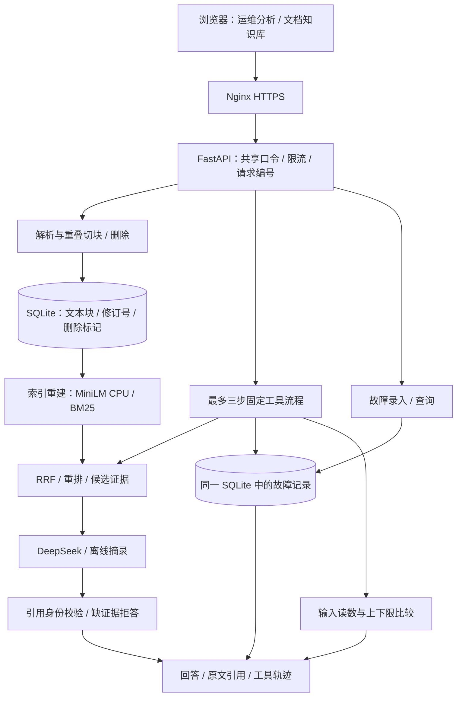

# 项目简历与演示材料

## 项目定位

**工业设备运维知识助手｜个人独立开发项目**。面向单公司维修资料查询场景，提供可追溯手册问答、设备故障记录和传感器区间比较。已有公网技术演示，尚未开展企业真实试用，不称为生产级多租户 SaaS 或自主规划 Agent。

## 可直接改写进简历

- 基于 Python/FastAPI 开发工业运维 RAG 工作台，支持 TXT/Markdown/文字 PDF 导入、来源与页码追溯、SQLite 持久化及手册删除后索引同步；提供故障记录录入和按设备查询。
- 集成本地 CPU 多语言 MiniLM、BM25、RRF 与轻量重排，接入 DeepSeek 引用式回答及缺证据拒答；实现手册检索、故障历史和传感器阈值比较的最多三步受约束工具流程，返回执行轨迹与失败状态。
- 完成腾讯云 HTTPS/systemd 部署、访问口令保护与 GitHub CI；建立公开手册的固定评测草案，记录 60 次真实模型调用及 token/费用上界，并提供本地并发报告和人工审核流程。

本地 313 项 Python、8 项浏览器回归及独立演示录制测试通过。功能提交 `41e7d17` 对应 [CI 37588276119](https://github.com/leonzhanglikang-png/industrial-maintenance-copilot/actions/runs/37588276119) 实际通过 313 项 Python、8 项浏览器、Docker 构建和容器重启持久化；CI 默认跳过演示录制。简历空间不足时优先写核心行为及技术取舍，测试数量属于可选证据。

暂不写：已服务多家企业、降低维修时间 X%、答案准确率 X%、自主规划、多 Agent 协作、实时 IoT 故障预测、大规模高并发。这些均无相应证据。测试标签还未人工确认，暂不在简历中突出 Recall@5 或拒答百分比。

## 架构



SQLite 保存的是文本与结构化故障记录，向量索引在进程内构建。引用校验检查候选身份和引用编号，不保证每句话的语义正确。传感器数值和阈值由使用者输入，不连接真实设备。

## 两分钟演示

录制脚本：`frontend/e2e/demo.spec.js`。视频位于本机 `frontend/artifacts/portfolio-demo.webm`（忽略提交，避免把二进制材料混入源码）。录制运行真实网页/API，使用隔离 SQLite、演示资料和离线摘录回答，没有伪造 DeepSeek 视频。真实模型证据在 [EVALUATION.md](EVALUATION.md)。

流程：访问口令 → 文档上传 → 问题、设备编号与读数 → 回答与引用 → 三步轨迹 → 故障录入 → 缺证据拒答 → 手册删除。字幕由录制脚本临时添加，不属于产品界面。

先在隔离数据库上启动摘录模式服务，配置测试用访问口令，然后录制：

```bash
WORKBENCH_URL=http://127.0.0.1:8766 \
API_ACCESS_TOKEN=ci-only-local-smoke-token-not-for-deployment \
RECORD_DEMO=1 npm --prefix frontend test -- demo.spec.js
```

生成视频在 `frontend/test-results/demo-portfolio-demonstration/video.webm`，下一次测试会清理此目录，应先复制到 `frontend/artifacts/portfolio-demo.webm`。初次启动、依赖安装及语义模型配置见 README；视频默认使用不需要模型文件的哈希离线演示。

## 面试前要能回答

1. 为什么使用 BM25 与多语言向量？混合不一定更好，当前未审核测试上纯语义召回更高，怎么解释与验证？
2. 文档被删除后，SQLite、内存索引及其他进程怎样同步？为什么需要删除标记？
3. 故障历史怎样按设备编号保存和查询？如何避免把 JSON 示例说成真实客户数据？
4. 合法 S1 引用与答案有事实依据是什么区别？11 个中文拒答案例说明什么？
5. 为什么 Agent 使用固定最多三步策略？失败时哪些结果被保留，哪些工具不再执行？
6. 本地离线接口 P95、串行真实模型耗时和公网端到端 P95为什么不能混用？
7. 共享口令适用于什么演示范围？多公司产品需要哪些账号、权限和租户边界？

人工审核表已生成，仍需真实人员填写。获取真实维修人员的反馈后，再补可用性记录；不要将自测描述成企业试点。
